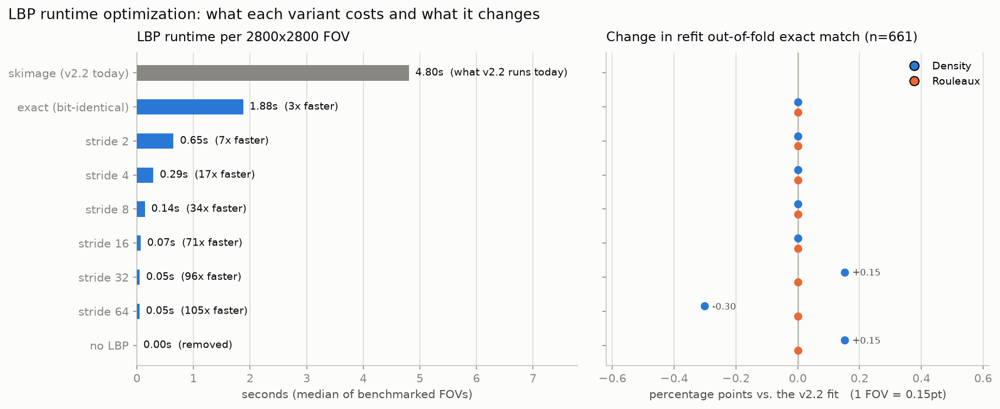

# LBP runtime: a 2.6x exact speedup, a 71x approximate one, and removal is nearly free

`lbp_entropy` was 4.8 of the 5.9 seconds `_v2_common.compute_features` spent on a 2800x2800
FOV — 82% of the feature vector's cost for a feature carrying 0.065 of the density composite's
weight and **none** of the Rouleaux composite's. This directory is the measurement of three
ways to make that cheaper, all on branch `lbp-runtime-optimization`, all against the full
661-FOV v2.2 calibration set.

**Only the bit-identical variant is wired into the pipeline.** The approximate strides and the
no-LBP variant exist as feature CSVs and params JSONs here; `compute_features` and
`EMPTY_FIELD_FEATURES` are unchanged, and no v2.2 artifact was overwritten.

## Headline

| | LBP per FOV | `compute_features` per FOV | label changes on 661 FOVs |
|---|---|---|---|
| v2.2 today (skimage) | 4.80 s | 5.85 s | — |
| **exact fast kernel** | **1.88 s** (2.6x) | **3.08 s** (1.9x) | **none — bit-identical** |
| **stride-16** | **0.07 s** (71x) | **1.08 s** (5.4x) | **none** |
| stride-32 | 0.05 s (96x) | ~1.03 s | 2 density, 0 Rouleaux |
| no LBP at all | 0 s | ~0.98 s | see the gate section — this is the one with a catch |

Two things fall out of this that matter more than the speedups:

1. **Past stride-16 there is nothing left to win.** LBP drops to 0.07 s, at which point
   `correct_illumination`'s 301-px blur (0.63 s) is the bottleneck. Stride-32 and stride-64 buy
   0.02 s between them while starting to move labels — pure risk for no wall-clock return.
2. **The composite barely depends on this feature.** Subsampling its histogram 256-fold
   (stride-16) changes not one of 1322 bucket assignments. Removing it entirely *improves*
   out-of-fold density exact-match by one FOV. The runtime problem here was never buying
   much accuracy.



## 1. Exact: bit-identical, 2.6x

`src/features/lbp_entropy.py` now computes the uniform-method LBP as whole-array numpy
operations over cache-sized tiles across threads, instead of skimage's generic per-pixel Cython
loop. `lbp_entropy()`'s signature and return value are unchanged; the old implementation is
kept as `lbp_entropy_skimage()` and asserted against by `scripts/combined/bench_lbp.py`, which
checks `np.array_equal` on the full code map for five real FOVs (both local datasets plus one
streamed from GCS) and on small random arrays where every pixel is a border pixel.

Reproducing skimage bit-for-bit needed three details, two of which are genuinely easy to miss:

- Offsets are **rounded to 5 decimals** before use.
- skimage computes `dr = (row + rp[i]) - floor(row + rp[i])`. Subtracting from a coordinate as
  large as 2799 **loses low bits**, so the interpolation weight differs slightly from row to
  row. A single scalar weight per offset still matches on random noise but diverges on real
  images: flat regions are exact ties where `(1-dc)*a + dc*a != a` in floating point, flipping
  the sign of `interp - centre >= 0`. The first prototype hit exactly this and was wrong by
  1e-5 in entropy. Weights are per-row and per-column vectors for this reason.
- The transition count is **non-circular** (`for i in range(P-1)`) — bit P-1 to bit 0 is never
  counted.

**Backend: threads, not processes.** Both were measured (`bench_lbp.py --steps 1`):

| backend | time | exact |
|---|---|---|
| serial | 4.40 s | yes |
| threads x8 | **1.80 s** | yes |
| processes x8 | 5.05 s | yes |

Processes lose badly — Windows spawns 8 interpreters per call, which costs more than the GIL
contention it avoids. It also does not work naively: the first attempt returned *different*
codes, because a row strip starting at local row 0 recomputes the low-bit-lossy weights at the
wrong absolute row. `_lbp_codes` takes a `row_offset` so a strip can say where it came from.

Threads only reach ~2.4x over serial on 16 cores because numpy's per-operation dispatch holds
the interpreter lock; the arithmetic itself is memory-bandwidth-bound. Getting past this needs
a fused compiled kernel (numba), which was deliberately not taken on — it would add a
dependency pinned tightly to numpy, and this env runs numpy 2.5.1.

## 2. Approximate: stride the centre grid, not the image

`step > 1` evaluates LBP on a stride-`s` grid of **centre pixels** while still sampling
neighbours at full-resolution radius 3. The codes stay bit-identical to the corresponding
pixels of the full map; only the histogram is estimated from a subsample, so the error is pure
sampling noise.

This is a different thing from `src/features/lbp_entropy_fast.py`, which downsamples the
*image* first and therefore changes the operator's spatial scale. Measured on 9 FOVs, that
approach drifts **-0.60 at downsample=2 and -1.52 at downsample=4**, against a calibrated
feature range of [3.118, 4.196] — a 141% shift. Striding centres 16-fold drifts 0.009 on
average. That module stays unused.

| stride | LBP s | speedup | mean drift | max drift | density flips | Rouleaux flips |
|---|---|---|---|---|---|---|
| 2 | 0.65 | 7x | 0.0046 | 0.054 | 0 | 0 |
| 4 | 0.29 | 17x | 0.0050 | 0.053 | 0 | 0 |
| 6 | — | — | 0.0057 | 0.058 | 0 | 0 |
| 8 | 0.14 | 34x | 0.0060 | 0.053 | 0 | 0 |
| 12 | — | — | 0.0079 | 0.057 | 0 | 0 |
| **16** | **0.07** | **71x** | **0.0089** | **0.062** | **0** | **0** |
| 24 | — | — | 0.0127 | 0.064 | 1 | 0 |
| 32 | 0.05 | 96x | 0.0164 | 0.069 | 2 | 0 |
| 48 | — | — | 0.0240 | 0.102 | 2 | 0 |
| 64 | 0.05 | 105x | 0.0330 | 0.149 | 5 | 0 |
| 96 | — | — | 0.0470 | 0.166 | 5 | 0 |

Flips are from the **fixed-params arm**: all 661 FOVs scored with
`density_overlap_v2.2_params.json` untouched, swapping only `lbp_entropy` — i.e. what happens
if a faster LBP is dropped into the deployed pipeline without recalibrating. Rouleaux cannot
move at any stride, because v2.2's Rouleaux fit dropped `lbp_entropy` for sign instability.

The **refit arm** (rerunning the v2.2 fit on each variant's feature CSV) moves fitted weights
and thresholds only in the 4th decimal: lbp weight 0.06536 (v2.2) vs 0.06475 (stride-2) vs
0.06504 (stride-32); the first density threshold 0.291705 vs 0.291682 vs 0.291819.

### The two requested variants

- **Conservative — zero label changes: stride-16.** 71x on the feature, 5.4x on the whole
  feature vector, and not one of the 1322 bucket assignments moves. Stride-16 is the largest
  stride that holds this; 24 is the first to break it.
- **Some flipping allowed, off-by-one must not degrade: no stride is selected by this bar,
  because off-by-one never degrades.** It sits at 0.9818 (fixed-params) and 0.9803 (refit) for
  every stride from 2 to 96 — the flips are all single-bucket, so off-by-one is blind to them.
  Given that, the honest recommendation for this slot is still **stride-16**, chosen on
  runtime saturation rather than accuracy: stride-32 gives up 2 FOVs to save 0.02 s. If a
  looser variant is wanted anyway, **stride-32** is the defensible one (2 flips, off-by-one
  intact, and its refit OOF density exact-match is actually 0.15pt *higher* than v2.2's).

One second-order effect worth knowing: the empty-field gate's floor is the p2 percentile of
`lbp_entropy`, so LBP drift perturbs which FOVs trip the gate even when no label moves. At
stride-32 the gate fires on 4 FOVs instead of 3. All 4 are manually labeled sparser + no
rouleaux, so the gate's safety invariant holds — but `check_empty_field_gate.py` fails against
its hardcoded v2.2 count, correctly. Stride-2 and stride-16 both pass it unchanged.

## 3. Removing LBP: free in-distribution, costs the empty-field gate

Expressed as excluding `lbp_entropy` from the candidate feature list at refit — `compute_features`
is untouched.

In-distribution, removal is not a loss:

| | v2.2 | no LBP |
|---|---|---|
| density refit OOF exact-match | 0.6944 | **0.6959** |
| density refit off-by-one | 0.9803 | **0.9818** |
| density CV mean rho | 0.783 | 0.782 |
| Rouleaux (all metrics) | unchanged | unchanged |

The freed weight redistributes mostly onto `coverage` (0.236 -> 0.251), `saturation_score`
(0.247 -> 0.266) and `edge_density_unmasked` (0.098 -> 0.118).

**The cost is entirely the empty-field gate.** It is a 4-of-4 rule over `otsu_separability`,
`lbp_entropy`, `glcm_contrast`, `edge_density_unmasked`; with LBP gone,
`calibrate_v2.empty_field_block` correctly ships the gate **disabled**, and Nigeria 081226
falls back to the ungated composite:

| Nigeria 081226 (8 FOVs, out-of-distribution) | density | Rouleaux | both |
|---|---|---|---|
| v2.2 (4-of-4 gate) | 8/8 | 8/8 | **8/8** |
| no LBP, gate disabled | 6/8 | 6/8 | **6/8** |
| no LBP, 3-of-3 gate force-enabled | 8/8 | 8/8 | **8/8** |

The two FOVs lost are the near-empty fields the gate exists for — scored (dense, heavy
rouleaux) and (very dense, heavy rouleaux) on fields with almost no cells.

**The 3-of-3 gate is safer than `empty_field_block`'s warning implies, for a specific reason.**
That warning is about a 3-*of-4* rule, and it is right: `dpc-154-KTR-72502948.png` is a genuine
monolayer sitting 3 features below floor, held out only by `otsu_separability`. But dropping
`lbp_entropy` specifically gives a rule that still requires `otsu_separability`, so dpc-154
still fails it. Measured on the 661-FOV set with the floors held at their v2.2 values (they do
not move — the other three features' p2 percentiles are unaffected by dropping LBP):

| gate | fires on | all genuinely sparse? | in-distribution effect |
|---|---|---|---|
| 4-of-4 (v2.2) | 3 FOVs | yes | none |
| 3-of-3 (no LBP) | 7 FOVs | **yes** | +1 correct density prediction (0.7005 -> 0.7020) |

So `lbp_entropy` was the *binding* condition holding the gate back on 4 truly-sparse FOVs.
Enabling a 3-of-3 gate is a deliberate decision that `empty_field_block` refuses to make
automatically, and it should stay that way — but the measurement says it is defensible here.

## Recommendation

1. **Take the exact kernel unconditionally.** 2.6x for a bit-identical number is not a
   tradeoff; `bench_lbp.py` is the standing proof.
2. **If more is needed, take stride-16.** 71x, zero label changes on 661 FOVs, gate check
   passes unchanged. Adopting it means adding a `step` argument to `compute_features` and
   refitting to v2.3 — deliberately not done here.
3. **Do not go past stride-16.** LBP is no longer the bottleneck there; further striding trades
   labels for nothing.
4. **Removing LBP is viable but is a bigger decision than a runtime one.** It saves 0.07 s over
   stride-16 and needs the 3-of-3 gate enabled to hold Nigeria at 8/8. Worth revisiting at the
   v2.3 refit, when the deferred 669-FOV set pools in the very FOVs the gate targets.

## Reproducing

```bash
# 1. the exactness gate + timings  (writes runtime-bench.csv)
python scripts/combined/bench_lbp.py --steps 1 2 4 8 16 32 64 --repeat 2

# 2. one pass over 661 FOVs, all strides   (~14 min; --append widens the sweep cheaply)
python scripts/combined/extract_lbp_variants.py --steps 2 4 6 8 12 16 24 32 48 64 96 --workers 4

# 3. patch only the lbp_entropy column per variant
python scripts/combined/build_variant_features.py

# 4. both comparison arms + per-variant params JSONs
python scripts/combined/compare_lbp_variants.py --steps 2 4 6 8 12 16 24 32 48 64 96

# 5. the figure
python scripts/combined/plot_lbp_variants.py

# 6. gate checks and the Nigeria OOD run
python scripts/combined/check_empty_field_gate.py --features features-v2.2-step16.csv \
    --params ../density-rouleaux-v2/density_overlap_v2.2_params.json
python scripts/nigeria_081226.py --params data/results/lbp-runtime/density_overlap_v2.2-nolbp_params.json --suffix nolbp
python scripts/nigeria_081226.py --params data/results/lbp-runtime/density_overlap_v2.2-nolbp-gate3_params.json --suffix nolbp-gate3
```

`--workers 4` is not a typo: this work is memory-bandwidth-bound, and 8 workers measured
*slower* than 4 (1.69 vs 1.24 s/FOV). The 324 tanzania-080526 FOVs stream from GCS on every
run and are never cached to disk.

## Files

| file | what |
|---|---|
| `runtime-bench.csv` | per-FOV timings and drift, from `bench_lbp.py` |
| `lbp-variants.csv` | LBP entropy at every stride for all 661 FOVs |
| `features-v2.2-step<N>.csv` | `features-v2.2.csv` with only `lbp_entropy` swapped |
| `density_overlap_v2.2-<variant>_params.json` | each variant's refit |
| `density_overlap_v2.2-nolbp-gate3_params.json` | no-LBP refit with the 3-of-3 gate force-enabled, for measurement |
| `variant-comparison.csv` / `.json` | both arms, every variant, both axes |
| `variant-tradeoff.png` | the figure above |

Nigeria outputs live with the rest of that dataset's results, under
`data/results/nigeria-081226/` with suffixes `nolbp` and `nolbp-gate3`.
