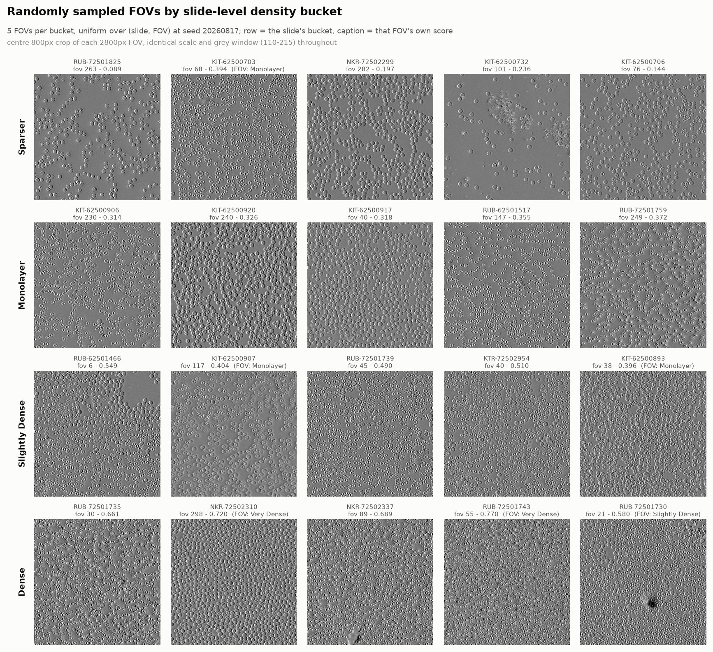
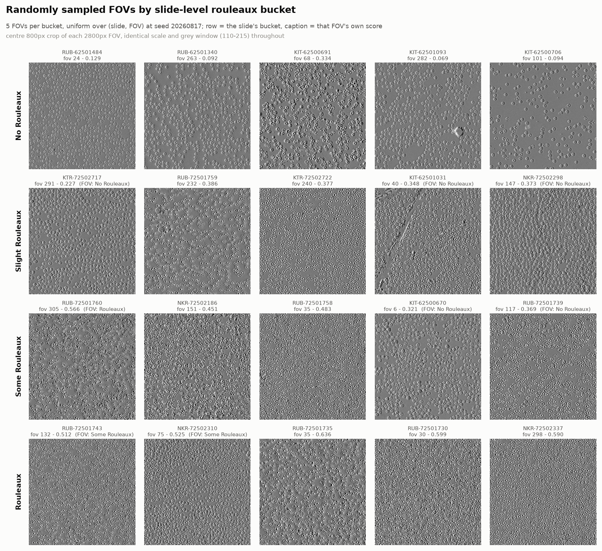
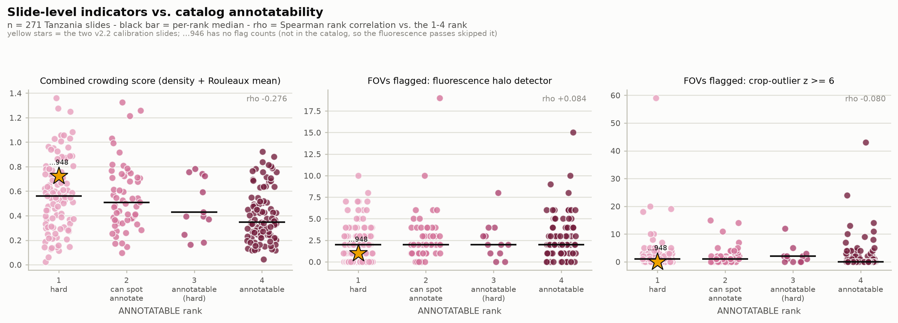
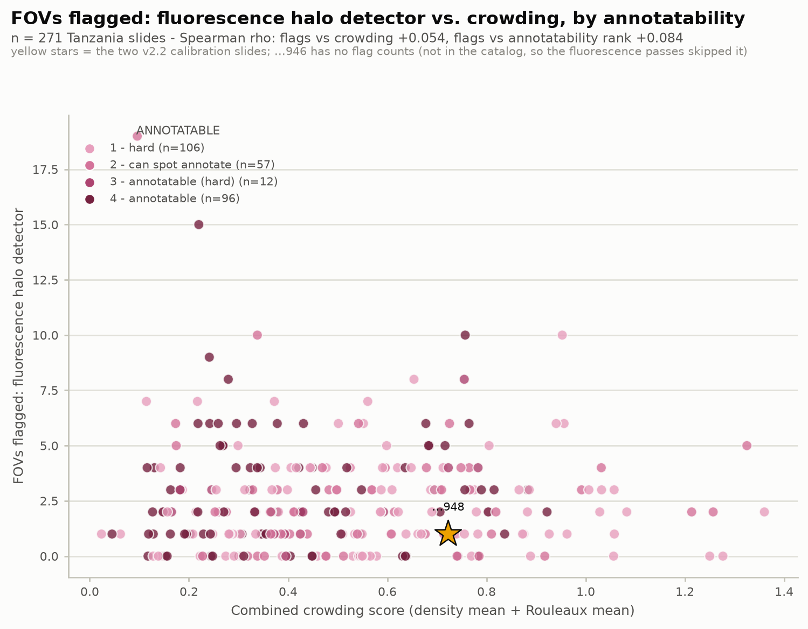
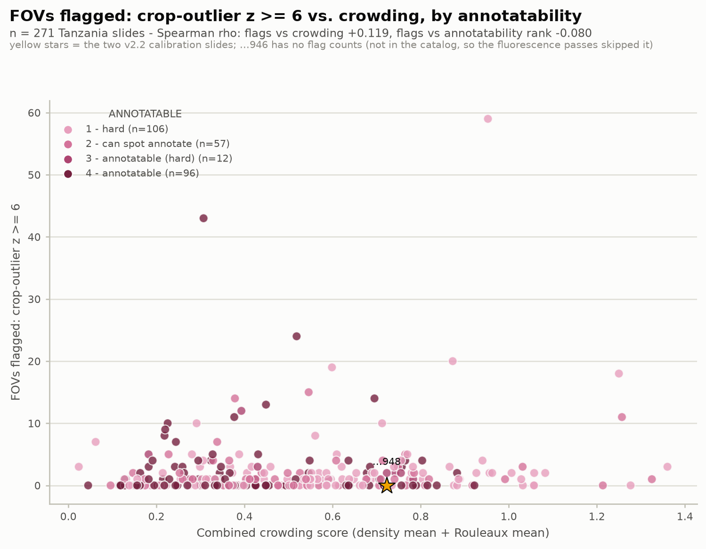
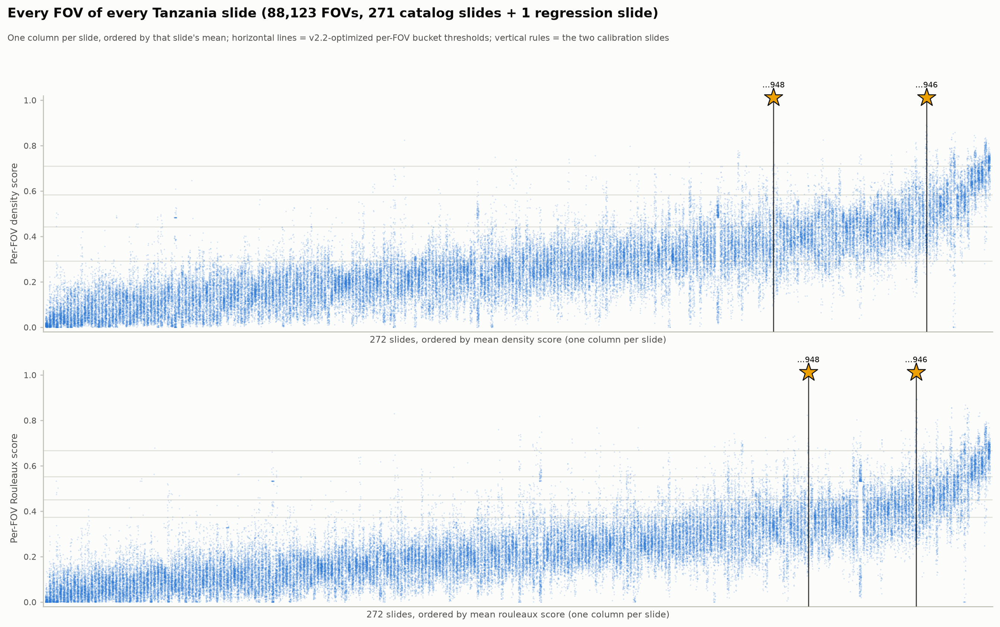
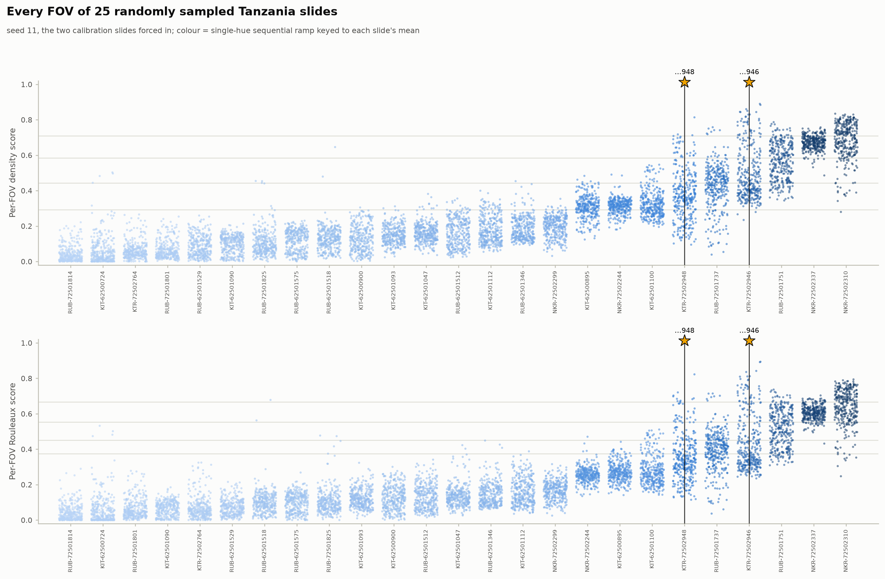

# Tanzania complete: slide-level crowding across all 271 catalog slides

Scores every DPC FOV of every Tanzania slide in the annotatability catalog, collapses each slide
to a mean density and mean Rouleaux score, and places each slide in the 5×5 calibrated bucket
grid. Two fluorescence FOV-flagging methods run over the same slides
(`../../../fluorescence/data/results/tanzania-complete-081426/`) so per-slide artifact rates can
be compared against crowding on a common axis set.

**Why:** the v2.2 family has only ever been run on 8 Nigeria FOVs and two Tanzania slides, and
all but Nigeria were inside its own 661-FOV calibration set. Nothing is known about the
*population* distribution of crowding, so it is an open question whether the calibrated bucket
edges land sensibly on a real cohort or compress it into two or three cells.

Everything streams from GCS. No image is ever written to disk.

## Status: complete

Run on a `n2-standard-32` Spot VM in `us-central1`, 2026-08-17, ~2 h 03 min end to end,
`status=complete` on all 271/271 slides.

| stage | result |
|---|---|
| crowding pass | 272 slides, **88,123 FOVs, 0 errors**, 31.9 FOV/s, median 81 s/slide |
| overexposure pass | 271 slides, **87,801 FOVs, 0 errors**, 19.8 FOV/s |
| crop-outlier pass | 271 slides in 3.3 s, source split 187/84 asserted |
| `.failed` sidecars / error logs | **none** |

The throughput bench chose **8 processes x 8 threads** (29.75 FOV/s projected, 31.9 achieved).
The thread knee was at **8 threads even on 32 vCPUs** -- identical to the 16-core laptop --
confirming the ceiling is the GIL rather than core count, which is what the processes-of-threads
design exists for. Pure threading would have taken ~1.7 h instead of 46 min. Note 8 was the top
of the `--procs-list` and throughput was still climbing (25.9 -> 29.75), so the real knee is
probably higher; widen the list if this is ever re-run.

## Results

### The cohort is overwhelmingly sparse, and the calibration is mis-centred for it

| density bucket | slides (bucket-of-mean) | slides (modal per-FOV) |
|---|---|---|
| **sparser** | **165** | 170 |
| monolayer | 76 | 66 |
| slightly dense | 24 | 28 |
| dense | 6 | 5 |
| very dense | **0** | 2 |

**61% of Tanzania slides land in the bottom density bucket and none in the top.** Only
**6 of 25** grid cells are occupied, with 165 slides in a single cell.

**This is not an artifact of averaging.** That was the worry going in -- per-FOV thresholds
applied to a 324-FOV mean could compress everything toward the centre. The `*_bucket_modal`
columns exist to test exactly that, and they rule it out: bucket-of-mean and modal-per-FOV agree
on **256 of 271 slides** (165 vs 170 sparser). The individual FOVs really are mostly sparser.
Within-slide per-FOV density spread (median std 0.076) is also *smaller* than the between-slide
spread (0.140), so slides are internally homogeneous and a slide mean is a sound summary.

The honest reading: v2.2's bucket edges were derived from 661 FOVs drawn from two Tanzania slides
plus 13 initial ones, and that sample is substantially denser than the cohort it is being applied
to. Median slide density mean is **0.247**, below the sparser/monolayer edge of 0.2916. The fit is
not wrong so much as **centred on the wrong part of the distribution** -- which is the concrete,
label-free case for revisiting the normalization ranges (see "Next").

**A prediction this run falsified.** The plan warned to expect a *dense*-shifted grid, because
`70a8cd4` recorded that the density composite over-estimates by 2+ buckets on 10 of 661
calibration FOVs, all monolayer -> dense. The opposite happened, and by a wide margin. That
over-scoring is real at FOV level but is nowhere near the dominant effect at cohort scale.

### Example FOVs per bucket



`sample_bucket_examples.py`, 5 FOVs per bucket, drawn **uniformly at random** over (slide, FOV)
from the slides in each slide-level bucket at seed 20260817. Not curated: FOVs were not filtered
to ones whose own label matches the row, so where a random draw disagrees with its slide's bucket
the caption says so (`(FOV: Monolayer)` etc.) instead of the example being dropped. The exact
(slide, fov, blob) list is in `bucket-examples-density.csv` / `-overlap.csv`.

Two rendering choices, both load-bearing:

- **A fixed 800px centre crop, not the whole FOV.** A 2800px field shrunk to a 460px thumbnail
  turns cells into sub-pixel noise -- the first render was four rows of featureless grey. Crop size
  and display scale are identical for every thumbnail, so cell *density* stays directly comparable
  across rows.
- **One global grey window (110-215) for every image, never per-image normalization.** These DPC
  fields sit in roughly [113, 213], so the default 0-255 window wastes most of the range.
  Normalizing each thumbnail separately would make them legible while erasing exactly the
  brightness/contrast differences the composite is built from (measured std 11.2 on a sparse FOV
  vs 19.0 on a dense one).

**The sheet corroborates the headline.** The `sparser` row genuinely shows scattered cells with
visible background gaps; `monolayer` is a near-continuous single layer; `slightly dense` and
`dense` are progressively packed. The gradient is monotone and obvious. So the finding that 61% of
the cohort sits in the bottom bucket survives looking at the pixels -- it is not a scoring or
averaging artifact. 6 of 20 sampled FOVs carried a different per-FOV label than their slide's
bucket, which is the expected consequence of sampling one field out of ~324.



The Rouleaux sheet is itself evidence for the next section. Read down the rows and what increases
is **cell packing**, closely resembling the density sheet, rather than anything specific to
rouleaux (the coin-stack aggregation the axis is named for). 8 of 20 sampled FOVs disagreed with
their slide's bucket here, versus 6 of 20 on density. Stated as an observation about what the
images show, not as a hematological judgement -- but it is what a 0.995 correlation between the
two axes would predict.

### The two axes are one measurement at slide level

Pearson correlation between `density_mean` and `overlap_mean` across 271 slides: **0.9948**
(0.9935 on the raw means). Every occupied grid cell sits on the diagonal.

The calibration report already noted the two fitted composites correlate 0.972 at FOV level
against a true manual label correlation of 0.823. Averaging ~324 FOVs cancels the independent
noise and leaves the shared component, so at slide level the two axes collapse onto a line.
**`combined_score` is therefore near-perfectly redundant with either axis alone**, and the
continuous plot conveys roughly one dimension of information rather than two. Anything wanting a
genuinely independent second axis at slide level needs a Rouleaux measure that does not share
`coverage`, `saturation_score` and `tile_glcm_patchiness` with density.

### The empty-field gate barely matters here, and the gated-to-zero choice matters less

2,885 of 87,799 FOVs gated (**3.3%**); median slide 0, max 61%, only 3 slides above 50%.

The decision to count gated FOVs as 0.0 on both axes changes a slide mean by **0.0028 on
average** (median 0.247 vs 0.252 ungated). So the headline is not a product of that convention --
which is precisely why all three variants are stored.

### Fluorescence: the two methods flag at the same rate but disagree about which FOVs

| method | FOVs flagged | rate | per-slide median / max |
|---|---|---|---|
| overexposure (`present`) | 679 | **0.77%** | 2 / 19 |
| crop outlier (`robust_zscore >= 6`) | 641 | **0.73%** | 1 / 59 |

Nearly identical aggregate rates -- and **correlation of only 0.170 between them per slide.**
They are not redundant; they are finding largely different FOVs, which is the useful result for
deciding whether to run both. 52 slides have zero overexposure flags.

Neither method's flag rate tracks crowding (overexposure vs `density_mean`: **-0.014**; crop
outlier: 0.105), so fluorescence artifacts are essentially independent of how crowded a slide is.

Threshold sensitivity for crop outlier, re-swept locally with no network: z>=2 -> 6,165 flagged,
**z>=6 -> 641**, z>=10 -> 289.

### Where the calibration slides land — the mis-centring, measured

Every figure rings `KTR-72502948` and `KTR-72502946`, the two Tanzania slides that supply 648 of
v2.2's 661 labelled FOVs. Their position in the cohort they are used to score:

| calibration slide | density mean | percentile of cohort | Rouleaux mean | percentile |
|---|---|---|---|---|
| KTR-72502948 | 0.374 | **77th** | 0.352 | 81st |
| KTR-72502946 | 0.492 | **93rd** | 0.434 | 92nd |

**Both sit in the top quartile; one is at the 93rd percentile.** The fit's bucket edges were
derived from two slides that are among the densest in the cohort, and are then applied to a
population whose median slide is 0.247. That is the mis-centring stated as a measurement rather
than an inference, and it explains the shape of the grid without needing any appeal to scoring
error.

`KTR-72502948` is also ranked **`hard`** (rank 1) in the catalog's ANNOTATABLE column, with a
combined crowding score of 0.72 against a cohort median of ~0.46.

Note `KTR-72502946` is not one of the 271 and has no `slide-summary.csv` row, so its means come
from its per-FOV CSV (the crowding pass scored all 272). It is absent from any figure with a
fluorescence-flag axis, because those passes filtered to the catalog — the callout says so rather
than leaving a silent gap.

### Annotatability: crowding tracks it, fluorescence flags do not



The catalog's ANNOTATABLE column, ranked 1 `hard` < 2 `can spot annotate` < 3 `annotatable (hard)`
< 4 `annotatable` (106 / 57 / 12 / 96 slides), against each slide-level indicator:

| indicator | Spearman rho vs rank | median by rank 1 → 4 |
|---|---|---|
| **combined crowding score** | **−0.276** | **0.561 → 0.509 → 0.430 → 0.347** |
| FOVs flagged, halo detector | +0.084 | 2 → 2 → 2 → 2 |
| FOVs flagged, crop outlier | −0.080 | 1 → 1 → 2 → 0 |

**Crowding is monotone across all four ranks: more crowded slides are judged harder to annotate.**
The association is modest (rho −0.276, so crowding explains a minority of the judgement) but it is
consistent in direction at every step, which a noise relationship would not be.

**Neither fluorescence method tracks annotatability at all** — both correlations round to zero and
the halo detector's median is flat at 2 across every rank. So whatever makes a slide hard to
annotate, it is not the artifact rate either method measures.




The same data with flags on y and crowding on x, coloured by annotatability. Flag counts barely
track crowding either (halo +0.054, crop outlier +0.119). Colour is a **single-hue ordinal ramp**
rather than four categorical hues, because ANNOTATABLE is ordered and the question is whether that
order lines up with anything — four hues would discard the ordering. Ramp steps are 250/350/450/600
of the reference blue ramp, validated for the light surface (adjacent OKLCH ΔL 0.093 / 0.095 /
0.143 against a 0.06 floor; lightest step 2.06:1 contrast).

#### Is the slide mean the right way to aggregate? Yes — measured, not assumed

The row above uses the **mean** of a slide's per-FOV scores, which was an arbitrary choice until it
was tested. `../annotatability-permutations/` sweeps 52 alternatives against it on the 270
non-calibration slides — median, all 20 percentiles of a slide's FOV distribution, its range /
stdev / MAD / IQR, the mean of its top X% most crowded FOVs for X = 95…5, and the fraction of FOVs
above each bucket cut.

**No alternative is stronger than the mean** by a margin the data can resolve (paired bootstrap CI
on the difference), and the four spread statistics are significantly *weaker* — how much a slide's
FOVs vary among themselves carries no annotatability signal, only the overall level does. The
trimmed-mean family declines monotonically as more easy FOVs are trimmed away, which is evidence
against annotatability being driven by a slide's worst fields. The ceiling is rho ≈ −0.27 whatever
the aggregation, so the limit sits in the measurement or the label, not in the arithmetic.

That directory also splits the cohort by collection site, which is where the remaining structure
looks like it is: within-site rho ranges from −0.158 (KTR) to −0.390 (NKR), a wider spread than all
53 aggregations produce.

### Every FOV, by slide



All 88,123 scored FOVs: one column per slide, jittered, columns ordered by that slide's mean, with
the bucket thresholds drawn across. This is where "the slide mean is a valid summary" becomes
visible rather than asserted — the columns are visibly narrower than the sweep across them, which
is the within-slide std (median 0.076) being smaller than the between-slide std (0.140). It also
shows how much of the cohort sits below the first density threshold.



25 slides at seed 11 (both calibration slides forced in) with per-slide labels, so individual
distributions are readable. Some slides are tight and some span half the scale — `KTR-72502948`
runs from ~0.1 to ~0.7 — which is worth knowing before treating any single FOV as representative
of its slide.

Colour is a sequential ramp keyed to slide mean rather than 25 distinct hues: past roughly 8, hues
stop being reliably distinguishable and a rainbow implies unordered identity for what is an ordered
quantity. Keying it to the mean keeps every column distinguishable while the colour agrees with the
x position instead of competing with it, and columns are positionally separated so identity never
rests on colour alone. `--categorical` cycles the validated 8-hue theme if maximum adjacent
contrast is preferred.

### Hazard vs non-hazard

The 119 `positive ⚠` slides (PCR/microscopy truth conflict, excluded from the official 90-slide
split) are slightly *denser* than the 152 clean positives: median `density_mean` 0.274 vs 0.231.
Recorded rather than interpreted -- this analysis cannot say whether that is meaningful.

---

## Cross-validation is measuring the wrong thing

Full working in `../density-rouleaux-v2/calibration-report.md` (§ "Cross-validation grouping");
reproduce with `python scripts/combined/evaluate_grouping.py`.

`cross_validate` stratifies by **label** and splits **FOVs**, with no slide grouping. 648 of the 661
calibration FOVs come from two slides, so nearly every held-out FOV has ~250 FOVs of the *same*
slide in training — and this run measured that within-slide spread (median std 0.076) is *smaller*
than between-slide spread (0.140), i.e. those are near-duplicates. The published figures answer
"another FOV of a slide we have already seen"; the tool is deployed **per slide**.

| axis | metric | FOV-stratified (published) | leave-one-slide-out | gap |
|---|---|---|---|---|
| density | exact | 0.6944 | **0.5522** | −0.1422 |
| density | off-by-one | 0.9803 | **0.9622** | −0.0182 |
| density | mean abs err | 0.327 | 0.487 | +0.160 |
| density | CV mean rho | 0.783 | **0.534** | −0.249 |
| Rouleaux | exact | 0.6762 | **0.5915** | −0.0847 |
| Rouleaux | off-by-one | 0.9380 | **0.9228** | −0.0151 |
| Rouleaux | mean abs err | 0.398 | 0.501 | +0.103 |
| Rouleaux | CV mean rho | 0.737 | **0.122** | −0.615 |

The FOV-stratified column reproduces the recorded figures exactly, which validates the harness.
**Exact-match falls ~14 points on density and ~8.5 on Rouleaux; off-by-one barely moves.** So the
composite still lands in the right neighbourhood on an unseen slide — it is the exact bucket call
that was flattered.

**Do not read that Rouleaux CV rho of 0.122 as the model failing to rank.** Leave-one-slide-out means
11 folds, and 9 of them hold 1–4 FOVs, where a rank correlation is near-meaningless — one 4-FOV Liberia
fold scores −0.949 and drags the mean. The two 324-FOV folds carry 648 of the 661 FOVs and are the
only meaningful estimate:

| held-out slide | n | density exact / off-by-1 / rho | Rouleaux exact / off-by-1 / rho |
|---|---|---|---|
| KTR-72502946 | 324 | 0.657 / 0.994 / **+0.831** | 0.608 / 0.966 / +0.847 |
| KTR-72502948 | 324 | 0.457 / 0.935 / **+0.454** | 0.583 / 0.889 / +0.469 |
| **mean of the two** | 648 | **0.557 / 0.965 / +0.643** | **0.596 / 0.927 / +0.658** |

So the honest rank correlation on an unseen slide is around **+0.64 / +0.66**, not 0.122. But note the
second caution in that table: **the two folds disagree sharply** — density held-out rho +0.831 vs
+0.454 depending only on which slide is held out. With a two-slide calibration set the generalization
estimate is itself unstable, and no single number should be quoted without that range.

**Quote ~0.56 density / ~0.60 Rouleaux exact-match for a new slide**, with off-by-one (~0.96 / ~0.93)
as the more trustworthy number. Not wrong in the existing code: `percentile_ranges` and
`derive_thresholds` are already train-only per fold, so there is no range or threshold leakage.

## How to improve the calibration, in priority order

1. **Fix the measurement first** (done — `evaluate_grouping.py`, `grouped_folds()`). Any future refit
   must use slide-grouped CV or improvements cannot be told apart from better memorisation of two
   slides. `cross_validate` now takes an optional `fold_of`; the default is unchanged.
2. **Annotate slides that fill the coverage gap** — the section below, and the largest available win.
3. **Give the Rouleaux axis features that measure aggregation.** It correlates 0.995 with density at
   slide level, its contact sheet shows a packing gradient rather than stacking, and it is a strict
   near-subset of the density features (it shares `coverage`, `saturation_score` and
   `tile_glcm_patchiness`, and dropped `lbp_entropy` / `otsu_separability` for sign instability). No
   recalibration makes that independent. `scripts/ai-first/score_new_slide.py` already computes
   `rouleaux_fraction`, `n_isolated` and `touching_pairs` from instance segmentation and v2 ignores
   them; adding them to the Rouleaux candidate pool needs **no new labels**, just a refit.
4. **Renormalize the ranges** over 88k FOVs instead of 661 — fixes the 10–13% bottom-end clipping.
   Cheap and label-free, but it only restores resolution; it does not move where the edges sit.
5. **Reserve a real held-out test set.** Current out-of-distribution evidence is 8 Nigeria FOVs.

**What not to do:** add a handful of deliberately-diverse slides from a new site *as calibration*.
Diversity is a virtue in a test set and a liability in a small calibration sample — two dense slides
anchoring a 271-slide cohort is exactly that failure, and a few diverse Liberia slides would repeat
it in a new direction. Test on them instead.

## Recommended slides to annotate

`python scripts/tanzania-complete-081426/plan_annotation.py` → `annotation-plan.csv` (per-FOV
worklist with blob URIs).

**The gap, stated plainly.** The labelled pool's manual density labels are
`sparser 50 · monolayer 402 · slightly dense 104 · dense 55 · very dense 50` — **61% monolayer** —
while the cohort is **61% `sparser` slides**. The model has the least label information exactly
where the population is densest in count.

Selection uses two criteria, both derived from this run:

- **Quantile bins of slide mean density**, one slide per bin. Quantile bins allocate by cohort mass,
  so 5 of the 8 picks are `sparser` slides — that is the point, not a defect — while still reaching
  the top of the range.
- **Largest within-slide spread inside each bin.** A slide whose FOVs span 0.1–0.7 yields labels
  across several buckets; a tight slide yields near-duplicates. Since within-slide spread is
  *smaller* than between-slide spread, this is the axis along which slides differ in label value.

Within each slide the FOVs are sampled **stratified across that slide's own score range**, not at
random — a random quarter clusters at the slide's mode, where the model already has most of its
information.

| bin | slide | mean density | within-slide std | bucket | annotate |
|---|---|---|---|---|---|
| 0 | `RUB-72501824` | 0.076 | 0.098 | sparser | 81 of 324 |
| 1 | `RUB-72501771` | 0.161 | 0.171 | sparser | 81 |
| 2 | `KIT-62500834` | 0.181 | 0.167 | sparser | 81 |
| 3 | `KTR-72502943` | 0.203 | 0.119 | sparser | 81 |
| 4 | `RUB-72501818` | 0.260 | 0.238 | sparser | 81 |
| 5 | `RUB-72501749` | 0.325 | 0.190 | monolayer | 81 |
| 6 | `RUB-62501495` | 0.371 | 0.131 | monolayer | 81 |
| 7 | `KIT-62500670` | 0.491 | 0.277 | slightly dense | 81 |

**648 FOVs across 8 slides** (a quarter of each). That takes the labelled pool from 661 → 1,309 FOVs
and — the part that matters for the CV problem — from **11 → 19 slide groups**, which is what makes
grouped CV stable rather than merely honest.

Projected label coverage, using each FOV's *predicted* label as a proxy (the real labels may differ,
which is precisely why they are worth collecting):

| bucket | now | added | after |
|---|---|---|---|
| sparser | 50 | +369 | **419** |
| monolayer | 402 | +122 | 524 |
| slightly dense | 104 | +98 | 202 |
| dense | 55 | +40 | 95 |
| very dense | 50 | +19 | 69 |

`sparser` goes from 7.6% of the pool to 32%. Nothing new is added at the dense end, correctly — the
two KTR slides already supply 105 dense/very-dense FOVs, and the deficit is entirely at the sparse
end.

Adjust with `--slides` and `--fraction` if 648 FOVs is more than the annotation budget; the same
selection logic holds at smaller N, and the first few bins are the ones carrying the coverage gain.

### Next

The stored per-FOV feature vectors make one follow-up available with **no new labels and no
re-streaming**: check whether v2.2's p2/p98 normalization ranges clip this cohort, reusing the
`ood-report` logic from `scripts/nigeria_081226.py`. Given the median slide sits below the bottom
bucket edge, that is now a concrete question rather than a hypothetical. Weights and bucket
thresholds cannot be improved from this run -- both are fit against manual labels, and 87,799
unlabeled FOVs do not help.

## Model

`density_overlap_v2.2-optimized_params.json` (`lbp_step: 16`, `blur_downsample: 4`), which is
also `_v2_common.DEFAULT_SCORING_PARAMS`. Both knobs are read back out of the params file by
every inference path, so features can never be computed differently from the fit they are scored
against. `params_version` is a column in `slide-summary.csv`.

These results are **not** directly comparable to a v2.2 artifact: the two fits differ on 1 of 661
calibration FOVs, and `blur_downsample` moved the Rouleaux thresholds as well as the density ones
(it perturbs the tile-GLCM features that axis weights heavily). See
`../pipeline-runtime/README.md`.

## What the index found that the plan did not predict

- **87,799 DPC FOVs, not 87,804.** Three slides are genuinely short: `RUB-72501759` (322 dpc /
  323 fluorescent), `RUB-62501392` (323/323), `RUB-62501518` (322/323). The passes read the
  verified FOV id list out of `slide-index.json`, so they score what exists rather than
  generating NotFounds; `n_fovs_scored` will not equal 324 for those three and that is correct.
- **The 327-vs-324 trap is real but not where it was expected.** `dpc-preview.png`,
  `dpc-result.png` and `dpc-scan.txt` live under a nested `metadata/` prefix, not beside the
  FOVs. What *is* flat, `.png`, and not a FOV is **324 `segmentation-mask-<nnn>-<slide>.png` per
  slide** -- so `list_image_paths` on a slide prefix returns ~974 images, three times the FOV
  count, and a naive extension filter would score segmentation masks as fields of view. The
  passes anchor on `^dpc-\d{3}-` / `^fluorescent-\d{3}-` and reject anything nested;
  `build_slide_index.py` records the counts it filtered (88,123 masks across the sweep) so this
  is proven on all 272 slides rather than assumed from one.
- **`KTR-72502946` is not in the catalog.** It is the golden-value regression slide (324 verified
  per-FOV scores already committed under `../tanzania-080526/`), so `build_slide_index.py` adds
  it via `REGRESSION_SLIDES` with `in_catalog=False`. Every pass and the aggregator filter it out
  of the 271.
- **Crop-outlier source split is exactly 187 / 84**, as predicted: 187 slides resolve under
  `v8_hardneg_single_t0.995`, 84 only via the annotation bucket (a different, older detector).
  `crop_outlier_source` records which, per slide.

## Verification already run

| check | result |
|---|---|
| `catalog.py --assert-counts` | 271 slides, 152 `positive` / 119 `positive ⚠`, 23/22/45/181 split; hazard slides all unassigned |
| `check_empty_field_gate.py` | passes -- gate fires on 3 FOVs, changes no prediction, 0.6959 / 0.6838 |
| **golden-value regression** (`verify_regression.py`) | **max \|score − committed v2.1\| = 0.000e+00** on both axes, 0 label mismatches |
| fluorescence detector vs committed values | `present` and `contrast_ratio` exact on 12/12 KTR-72502946 FOVs |
| `crop_counts.robust_zscore` / `ratio_to_median` | reproduce all 324 committed case-study values exactly |
| aggregation arithmetic | mean hand-verified; `combined == d + o`; threshold-equality lands in the upper bucket; gated→0 correct; re-run byte-identical |
| crop-outlier z re-sweep | z=2 → 6,165 flagged FOVs; z=6 → 641; z=10 → 289 (local, no network) |
| palette | the two-hue option passes all six checks (protan/deutan ΔE 24.7 vs target 8; normal-vision 33.6 vs floor 15) |

The golden regression is the load-bearing one: it proves the new harness reproduces the already
validated `tanzania_080526.py` output bit-for-bit, and because v2.1 records neither runtime knob
it simultaneously proves `lbp_step_from_params` / `blur_downsample_from_params` default to 1.

## Decisions

**Gated FOVs contribute 0.0 to both axes** in the headline slide mean -- a FOV that trips the
empty-field gate is a near-empty field, so it adds no severity. Two other readings are stored so
the choice is visible and reversible with no recomputation: `*_mean_raw` (gate ignored) and
`*_mean_ungated` (gated FOVs dropped).

**The slide bucket is the slide mean run through the per-FOV thresholds.** Worth stating plainly
that this is not what those thresholds were fit for: a mean over ~324 FOVs has far less variance
than one FOV, so slide means compress toward the middle of the scale. `*_bucket_modal` and
`*_std` exist to tell a compressed grid apart from a genuinely uniform cohort.

**The crop-outlier flag threshold lives in the aggregator** (`--crop-outlier-z`, default 6.0),
not in the pass. The pass stores the raw z-score, so re-sweeping is a local re-run; the existing
v1/v2 scripts keep their own `OUTLIER_ZSCORE = 2.0` and are never asked to agree.

**`combined_score` is in the CSV and not plotted.** It is the sum of the two plotted axes, so on
the continuous plot it is exactly the anti-diagonal.

## Reading the results, when they land

`70a8cd4` records that the density composite over-estimates by 2+ buckets on 10 of the 661
calibration FOVs, all monolayer → dense, and that the empty-field gate correctly does *not* catch
them (9 of the 10 have 0 of 4 features below floor -- they are not near-empty). It is a
cross-stain/texture over-scoring problem and the next real modelling issue.

**So expect the cohort's density means to skew high for that reason, and do not read a
dense-shifted grid as a property of the Tanzania cohort without checking it.** The stored raw
features plus `truth_warn` / `train_test_split` / `region` are what separate a genuine cohort
skew from this known artifact.

## Files

| file | what |
|---|---|
| `slides.csv` | frozen catalog: slide_id, box, truth, truth_warn, split, region, in_catalog |
| `slide-index.json` | per slide: box, verified FOV ids per channel, gaps, what else is in the prefix |
| `fov/crowding/<slide>.csv` | per-FOV scores **and all 9 raw features**, written atomically per slide |
| `slide-summary.csv` | one row per catalog slide; 271 rows always |
| `plots/` | the continuous scatter, the 5×5 bucket grid, and the per-bucket example sheets |
| `bucket-examples-{density,overlap}.csv` | the exact sampled (slide, fov, blob) list + each FOV's own label/score, so any thumbnail traces back to its source and the sheet re-renders identically |
| `annotatability-summary.csv` | per-ANNOTATABLE-rank slide counts and median of each indicator |
| `annotation-plan.csv` | recommended annotation worklist: 648 FOVs across 8 slides, with blob URIs and predicted labels |
| `../density-rouleaux-v2/grouping-comparison.csv` | FOV-stratified vs leave-one-slide-out CV, per axis and per held-out slide |
| `logs/crowding-progress.jsonl` | one line per completed slide: wall time, errors, rate |
| `logs/crowding-errors.csv` | append-only, survives resumed runs |

The per-FOV CSVs keep the full feature vector on purpose: slide means, the gate rule, the z
threshold, bucket assignments and both plots are all recomputable from them with zero network, and
a label-free check of whether the fit's p2/p98 ranges clip this cohort needs the raw features.
Re-deciding any of that must never mean re-streaming 342 GB.

## Running it

```bash
# 0-1. catalog + index (once, ~1 min)
python scripts/tanzania-complete-081426/catalog.py --assert-counts
python scripts/tanzania-complete-081426/build_slide_index.py

# 2. correctness gates before spending VM time
python scripts/combined/check_empty_field_gate.py
python scripts/tanzania-complete-081426/verify_regression.py --params-check

# 3. the image passes (on the VM -- see the plan; ~2 h on n2-standard-32 Spot)
python scripts/tanzania-complete-081426/run_crowding_pass.py --procs 4 --threads 8 --mirror-gcs
python ../fluorescence/scripts/tanzania-complete-081426/run_overexposure_pass.py --threads 8

# 4. CSV-only, ~50 s
python ../fluorescence/scripts/tanzania-complete-081426/run_crop_outlier_pass.py --assert-sources

# 5. local, seconds, re-runnable
python scripts/tanzania-complete-081426/aggregate_slides.py
python scripts/tanzania-complete-081426/plot_slide_level.py

# 6. example FOVs per bucket (streams ~20 FOVs per axis; ~1 min each locally)
python scripts/tanzania-complete-081426/sample_bucket_examples.py --axis density
python scripts/tanzania-complete-081426/sample_bucket_examples.py --axis overlap

# 7. annotatability + per-FOV strip figures (local only, seconds)
python scripts/tanzania-complete-081426/plot_annotatability.py
python scripts/tanzania-complete-081426/plot_fov_strips.py
python scripts/tanzania-complete-081426/plot_slide_level.py --color-by annotatable

# 8. calibration diagnostics (local, seconds)
python scripts/combined/evaluate_grouping.py          # FOV-stratified vs leave-one-slide-out CV
python scripts/tanzania-complete-081426/plan_annotation.py   # which slides to annotate next
```

`--procs` fans out over processes because threads saturate: measured at the adopted params,
throughput peaks at **8 threads / ~3.8 FOV/s (2.9× over serial)** and *falls* by 24 threads,
since numpy's per-operation dispatch holds the interpreter lock. Threads still beat processes
per-core (see `../pipeline-runtime/README.md`), so the shape is processes-of-threads, sharded by
slide to keep one slide as the checkpoint unit. Confirm the knee on the VM before the full run.
