# Case study: KTR-72502946 (Tanzania), full slide (2026-08-11)

This slide was previously invisible to this whole pipeline. It's one of the two samples
(`KIT-62500763`, `KTR-72502946`) that showed up as `no_data` in both v1's `results.csv` and v2's
`boundary_negatives.csv` -- `tanzania_02032026`'s own `detection_results/` tree never got it
mirrored in. It has full detection data all along, in `gs://malaria-annotation-web`
(`samples/KTR-72502946/fov_summary.csv`) -- see `crop_counts.py`'s module docstring for the
fallback that now finds it (and `../README.md`'s Caveats section, updated the same day, for the
broader Tanzania gap this slide is one instance of: 146 slides across `TZ2025-Box1`/`Box5` never
mirrored into `tanzania_02032026`, all recoverable the same way).

## Method

Every one of this slide's 324 FOVs, scored against **one whole-slide baseline** (median and MAD
of `n_spots_detected` over all 324 FOVs, the target included -- `crop_counts.slide_baseline()`,
computed once per slide as of today's pipeline change, not per-target leave-one-out).
`ratio_to_median = n_spots_detected / baseline_median`, `robust_zscore = (n_spots_detected -
baseline_median) / baseline_mad`.

**Baseline for this slide:** median 53, MAD 26.687, mean 76.265, std 244.572 (a large
mean/median divergence -- expected, and explained below: one FOV is such an extreme outlier it
pulls the mean far from the median while barely moving it).

**Code:** `scripts/crop-outlier-approach/case_study_ktr72502946.py`, reusing
`crop_counts.load_slide_metric_counts`/`slide_baseline` unmodified. Full per-FOV output:
`case-study-KTR-72502946.csv` (324 rows). Run with `--previews` to also render the three 700px
raw fluorescence previews below, or `--thumbs` for the 260px contact sheet of the top 15
(streamed from GCS via `src.gcs_fov_multi.load_fov_image`, same downscale + caption convention as
`scripts/render_fn_fp_previews.py`).

Worth noting the raw fluorescence images for this slide were in `tanzania_02032026` all along
(`TZ2025-Box5/KTR-72502946/fluorescent-*.png`) -- it is specifically the `detection_results/`
tree that never got the sample mirrored in. So the Tanzania gap described above costs the
pipeline its crop counts, not its pixels.

**Model-version note (2026-08-12).** The fallback's `fov_summary.csv` for this slide comes from
model O2.0, not the `v8_hardneg_single_t0.995` the pipeline standardizes Tanzania on (see
`../README.md`'s Caveats). **This case study is unaffected:** `n_spots_detected` is produced by
the spot-finding step upstream of the classifier and is identical across model versions --
verified per-FOV on all 8 TZ slides that have both copies, and separately here by the fact that
this slide's O1.9, O2.0 and v8_hardneg_single prediction files all have exactly 15059 rows
(`= sum(n_spots_filtered)`). Every number on this page is a `n_spots_detected` number. Only
`n_positives` is version-dependent, and this case study does not use it.

## Results

**Distribution across all 324 FOVs:**

| `robust_zscore` >= | FOVs | % of slide |
|---|---|---|
| 2 | 33 | 10.2% |
| 5 | 3 | 0.9% |
| 6 (v2's recommended threshold) | 2 | 0.6% |
| 10 | 1 | 0.3% |
| 20 | 1 | 0.3% |
| 50 | 1 | 0.3% |
| 100 | 1 | 0.3% |

Range: -1.461 to 163.527. A single FOV dominates everything above `z=10` -- see below.

**The two labeled FOVs (`spot_truth=yes` in the 76-row label set) and the two v2 boundary FOVs
(1, 324), side by side:**

| fov_id | role | n_spots_detected | ratio_to_median | robust_zscore |
|---|---|---|---|---|
| 1 | boundary | 49 | 0.925 | -0.150 |
| 54 | labeled (spot_truth=yes) | 25 | 0.472 | -1.049 |
| 198 | labeled (spot_truth=yes) | 4417 | 83.34 | **163.527** |
| 324 | boundary | 50 | 0.943 | -0.112 |

**Top 15 FOVs by `robust_zscore`:**

| fov_id | role | n_spots_detected | ratio_to_median | robust_zscore |
|---|---|---|---|---|
| 198 | labeled | 4417 | 83.34 | 163.527 |
| 308 | - | 262 | 4.943 | 7.832 |
| 95 | - | 194 | 3.66 | 5.284 |
| 77 | - | 186 | 3.509 | 4.984 |
| 294 | - | 186 | 3.509 | 4.984 |
| 94 | - | 184 | 3.472 | 4.909 |
| 276 | - | 181 | 3.415 | 4.796 |
| 167 | - | 171 | 3.226 | 4.422 |
| 136 | - | 169 | 3.189 | 4.347 |
| 149 | - | 163 | 3.075 | 4.122 |
| 131 | - | 155 | 2.925 | 3.822 |
| 113 | - | 152 | 2.868 | 3.71 |
| 227 | - | 151 | 2.849 | 3.672 |
| 312 | - | 151 | 2.849 | 3.672 |
| 240 | - | 142 | 2.679 | 3.335 |

### All 15, with thumbnails

One 260px raw-fluorescence thumbnail per row of the table above, captioned in-image with `fov`
and `robust_zscore` (red caption = `high_outlier`, i.e. `z >= 2`; all 15 qualify). Rendered by
`case_study_ktr72502946.py --thumbs`. The right-hand column is a read off *this* thumbnail only --
see Caveats for how much weight it can carry.

| fov_id | z | thumbnail | what the image shows |
|---|---|---|---|
| 198 | 163.527 | 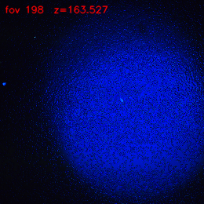 | **The only diffuse halo in the top 15.** One enormous saturating blue glow filling nearly the whole frame. |
| 308 | 7.832 | 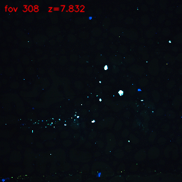 | Debris. Dark field, several large saturated blobs, distinctive diagonal streak of puncta lower-left. No glow. |
| 95 | 5.284 | 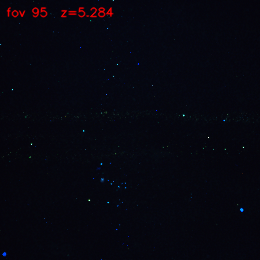 | Puncta concentrated in a horizontal band across mid-frame, suggesting a seam/scan-line artifact. No glow. |
| 77 | 4.984 | 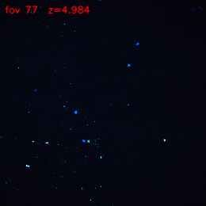 | Sparse bright puncta scattered fairly evenly over a dark field. No glow. |
| 294 | 4.984 | 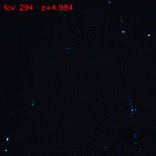 | Puncta strung along a rough vertical chain down the right side. No glow. |
| 94 | 4.909 | 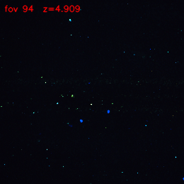 | Sparse puncta plus a few larger blue blobs near center; faint horizontal seam. No glow. |
| 276 | 4.796 | 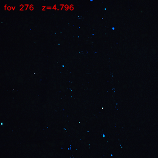 | Scattered puncta, noticeably denser in the right half. No glow. |
| 167 | 4.422 | 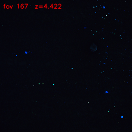 | Scattered puncta with two or three large blue blobs at left and right. No glow. |
| 136 | 4.347 | 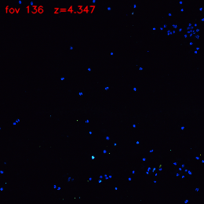 | The blobbiest of the set -- many distinctly large, round blue objects, densest upper-right. No glow. |
| 149 | 4.122 | 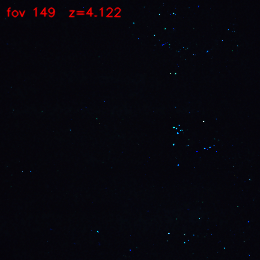 | Puncta in a vertical chain through center-right. No glow. |
| 131 | 3.822 | 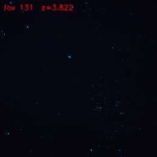 | Puncta clustered center-right and lower-right. No glow. |
| 113 | 3.71 | 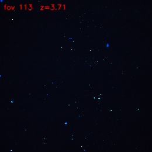 | Comparatively dense, evenly scattered small puncta. No glow. |
| 227 | 3.672 | 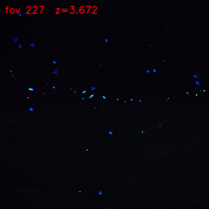 | Puncta along an arc across the upper-middle, several large blobs on it. No glow. |
| 312 | 3.672 | 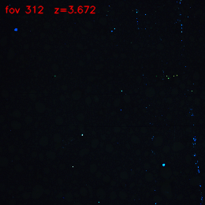 | Mostly empty dark field with puncta hugging the right edge in a vertical strip. No glow. |
| 240 | 3.335 | 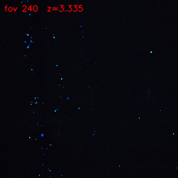 | Puncta clustered through the left and center. No glow. |

**The pattern in that column is the main new finding here: 1 halo, 14 debris.** FOV 198 is the
only diffuse glow anywhere in the slide's flagged tail; every other FOV the signal ranks highest
is elevated because the spot detector faithfully counted punctate junk. FOV 308, which the
original write-up singled out as a false positive after pulling its image, turns out to be the
*typical* case rather than an unlucky one. A recurring sub-pattern: in at least 7 of the 14
(308, 95, 294, 149, 227, 312, 240) the puncta are arranged along a line, band, edge, or arc
rather than spread at random, which is what debris and tile-boundary contamination look like and
is not what a halo looks like.

## The three FOVs that matter, with images

Raw fluorescence, downscaled to 700px, captioned with this analysis's own numbers. Red caption =
`high_outlier` (`robust_zscore >= 2`), green = not.

### FOV 198 -- labeled `spot_truth=yes`, overwhelming true positive (z=163.5)

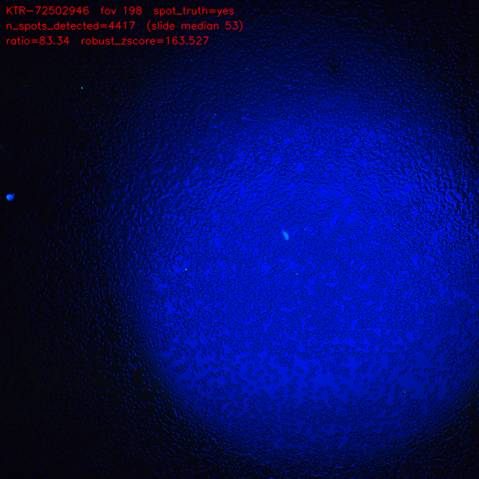

A textbook overexposure halo: a single huge, bright, diffuse blue glow covering most of the
frame. 4417 crops vs. a slide median of 53. The visual confirms the mechanism this whole approach
assumes -- a bright halo saturating the blue channel generates thousands of spurious local
maxima for the spot detector to find.

### FOV 54 -- labeled `spot_truth=yes`, clean miss (z=-1.05)

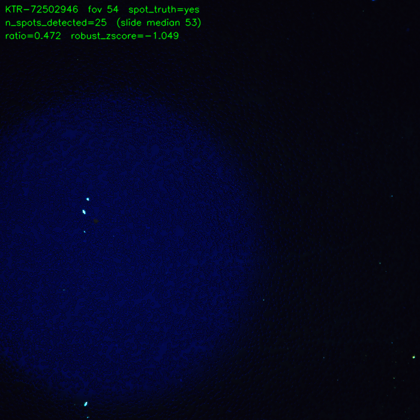

Also a confirmed halo, but a *far* fainter and dimmer one -- a soft, low-contrast glow in the
left/center of an otherwise dark frame, nothing like fov 198's saturating blaze. Only 25 crops,
below the slide's median of 53. **The image explains the miss:** this halo is dim enough that it
never pushes local-maxima counts above baseline, so a crop-count-based detector has nothing to
detect. This is the faint/diffuse failure mode v1's README names in the abstract, now visible
concretely.

### FOV 308 -- never labeled, flagged by the signal (z=7.83)

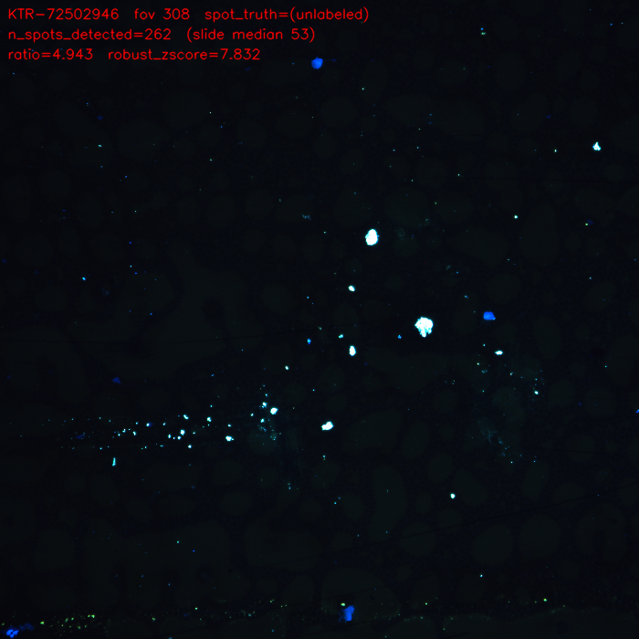

**Not a halo at all.** There's no diffuse glow anywhere in this frame -- instead it's covered in
bright punctate specks, including several large saturated blobs and a distinctive diagonal
streak of puncta across the lower-left. This is debris/artifact contamination, and the elevated
crop count (262 vs. median 53) is the spot detector faithfully finding all of it.

## Discussion

**This one slide reproduces both the strength and the weakness of the crop-count signal at
once.** Its two labeled FOVs are both confirmed genuine overexposure-halo artifacts
(`spot_truth=yes`), but the crop-count signal treats them completely differently:

- **FOV 198 is an overwhelming true positive** -- 4417 crops vs. a slide median of 53
  (83x), `robust_zscore=163.5`. This is on the same scale as the largest positives found anywhere
  in v1's 76-row analysis (max there: `robust_zscore=387.6`, `KIT-62501087` fov 271).
- **FOV 54 is a clean miss** -- 25 crops, *below* the slide's own median (`ratio=0.47`,
  `robust_zscore=-1.05`). A human confirmed a genuine halo here; the crop-count signal shows
  nothing unusual at all, let alone an excess. The images above show why: fov 198's halo
  saturates the frame, fov 54's is a faint dim glow.

**Both boundary FOVs behave exactly as the "presumed blank" assumption predicts.** FOV 1
(`z=-0.15`) and FOV 324 (`z=-0.11`) both sit almost exactly on the slide median -- on this
particular slide, at least, the corner-tile-is-blank assumption holds up well.

**FOV 308, the one unlabeled FOV clearing the recommended threshold, turns out to be a false
positive of this approach -- and the image is what settles it.** Before pulling the image, this
FOV read as a promising lead ("nobody has looked at it; exactly the kind of case this approach
surfaces for review"). The image shows it's debris, not a halo: bright punctate specks and a
diagonal streak, with no diffuse glow anywhere. So under the *original* halo-focused framing this
is a straightforward false positive, and it's the `background`/`artifact` confound v1 already
identified as the dominant source of overlap between the groups -- a whole-frame crop count can't
distinguish "one big halo inflated my count" from "lots of little bright junk inflated my count."

**The top-15 thumbnails turn that single data point into a pattern: 14 of the slide's 15
highest-scoring FOVs are punctate debris, and exactly one is a halo.** So on this slide the
crop-count signal is not a halo detector that occasionally trips on junk -- it is a junk detector
that happens to rank the one real halo first. The ranking does do useful work (198's `z=163.5` is
20x the next value, and the halo is the top hit), but everything below that single FOV is
debris, and the gap between "flagged" and "is a halo" is therefore far wider than the aggregate
numbers alone suggest. This is a one-slide result and the caveats below matter, but it is a
concrete illustration of how thin the halo-specific precision of this signal can be past the
top-ranked FOV.

Worth noting this cuts differently under v2's redefinition (positive = significant excess of
erroneous crops, *regardless* of cause): by that definition fov 308 is arguably a true positive,
since 262 debris-driven crops are genuinely erroneous crops the classifier has to process. Which
reading is right depends on what the downstream filter is for -- suppressing halo artifacts
specifically, or suppressing junk-inflated FOVs generally. This single FOV is a clean illustration
that those two goals are not the same thing, and v2's redefinition quietly commits to the
second one.

## Caveats

- One slide, two labeled FOVs -- not a basis for re-estimating recall on its own. It's useful as
  a concrete illustration of the aggregate finding, not a replacement for it.
- The fov 308 read above is from a single downscaled preview, not a full-resolution review or a
  second annotator -- confident enough to say "not a diffuse halo," but it hasn't been through
  the labeling process the 76-row set went through.
- **The same applies with more force to the other 13 thumbnails, which are 260px rather than
  700px.** "Diffuse glow vs. punctate specks" is a coarse enough distinction to survive that
  downscale -- a halo like 198's is unmistakable even at thumbnail size -- but these are eyeball
  reads by one reviewer off a contact sheet, not labels. The finer descriptions (streak vs. band
  vs. cluster, blob size) are impressions and should not be treated as annotations. A faint halo
  of the fov 54 variety *co-occurring* with debris in one of these frames could well be invisible
  at 260px, so "14 debris" is a claim about the dominant content of each frame, not proof that
  none of them contains any halo at all.
- The top 15 stops at `robust_zscore = 3.335`. 18 further FOVs on this slide sit at `z >= 2` below
  that cut and were not inspected; given that all 14 non-198 FOVs above the cut are debris, those
  are likely debris too, but they were not looked at.
- The 1-halo/14-debris ratio is specific to this slide's flagged tail and should not be read as a
  precision estimate for the approach overall. It is one slide, and a slide whose single halo is
  an extreme outlier.

## Files

- `case-study-KTR-72502946.csv` -- full per-FOV output (324 rows)
- `previews/KTR-72502946__fov{54,198,308}__preview.png` -- the three 700px previews above
- `previews/thumbs/KTR-72502946__fov*__thumb.png` -- the 15 260px top-N thumbnails (~1.1MB total)
- `../../../../scripts/crop-outlier-approach/case_study_ktr72502946.py` -- script that produced
  all of the above (`--previews` for the three previews, `--thumbs` for the 15 thumbnails)
